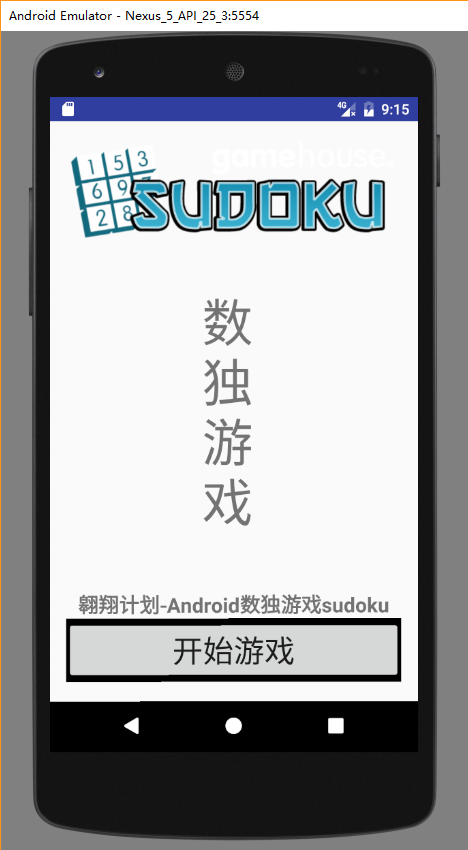

##游戏界面设计
###三个主要界面  
* 游戏界面
  * 图1 

* 欢迎界面 
  * 图2
  
* 数字选择界面  
  * 图3

##代码功能讲解
+ manifest
 + -AndroidManifest.xml 应用程序清单文件。里面包含了一些应用程序的信息
+ java ：java程序文件
 + -ycf.com.sudoku 包名。 ycf是你名字的缩写
   + -Game： 游戏类
   + -KeyDialog： 数字的1-9的选择对话框
   + -WelcomweActivity： 欢迎窗体
   + -GameView：定义游戏界面的视图
   + -GameAcvtivity：游戏主界面
+ res/layout：布局文件
   + activity_welcome.xml:欢迎界面布局
   + keypad：数字1-9选择对话框布局

##Game类
	
+ 数独的抽象类：可以根据初始化的字符串生成9*9数独，根据提供的位置（x,y）获取该位置下的数字。同时能获取每个单元格可以使用的数字。

		String str //数组初始化数据
		int sudoku[] //数独数组
		int used[][][] //存储每个单元格不可用的数据
	
		private int getTile(int x,int y) //根据九宫格当中的坐标，返回该坐标填写的数字(没填写是数字0)
		private int[] fromPuzzleString(String src) //根据一个字符串数据，生成一个整形数组，所谓数独游戏的初始化数据
		public void calculateAllUsedTiles() //用于计算所有单元格对应的不可用数据
		public int[] calculateUsedTiles(int x,int y)//计算某一单元格中已经不可用的数据
		private void setTile(int x,int y,int value) //重新设置值

##keyDialog类
+ 数字选择的提示对话框。根据选择的位置，自动提示该位置下可以填入的数字，当单击该数字时，游戏视图会被修改并重新刷新。 
+ 对应keypad.xml文件所描述的界面。
	
		private final View keys[] = new View[9];//1-9格数字
		private final int used[];//当前单元格已经使用的数字
		private ShuduView shuduView;//游戏界面视图

		//通知shuduView对象，刷新整个九宫格显示的数据
		private void returnResult(int title){
			shuduView.setSelectedTile(title);
			//取消对话的显示
			dismiss();
		}

##WelconmeActivity类
+ 功能：游戏的欢迎界面。点击开始游戏按钮时，通过intent消息打开GameActivity。

		public class WelcomeActivity extends Activity implements OnClickListener{
		
		    @Override
		    protected void onCreate(Bundle savedInstanceState) {
		        super.onCreate(savedInstanceState);
		        setContentView(R.layout.activity_main);
		
		        Button bt=(Button)this.findViewById(R.id.start);
		        bt.setOnClickListener(this);
		    }
		    @Override
		    public void onClick(View v) {
		        switch (v.getId()) {
		            case R.id.start:
		                Toast.makeText(WelcomeActivity.this, "开始游戏啦^ - ^", Toast.LENGTH_SHORT).show();
		                Intent intent =new Intent(this,GameActivity.class);
		                startActivity(intent);
		                break;
		            default:
		                break;
		        }
		    }
		}

##GameActivity类
+ 功能：  数独游戏的主体。其视图和功能再ShuduView中定义

		public class GameActivity extends Activity {
		    @Override
		    protected void onCreate(Bundle savedInstanceState) {
		        super.onCreate(savedInstanceState);
		        setContentView(new ShuduView(this));
		    }
		}

##ShuduView类
+ 游戏的主要界面 

	    private float width;//单元格的宽度
	    private float height;//单元格的高度
	    int selectedX;//选中单元格的位置横标
	    int selectedY;//选中单元格的位置纵标
	    private Game game = new Game();//数独游戏类

+ 重写ondraw方法绘制数独游戏界面  

		 @Override
    	protected void onDraw(Canvas canvas) 
		{
        //生成用于绘制背景色的画笔
        Paint backgroundPaint = new Paint();
        //绘制画笔的颜色
        backgroundPaint.setColor(getResources().getColor(R.color.shudu_backgroud));
        //绘制背景色
        canvas.drawRect(0, 0, getWidth(), getHeight(), backgroundPaint);

        Paint darkPaint = new Paint();
        darkPaint.setColor(getResources().getColor(R.color.shudu_dark));

        Paint hilitePaint = new Paint();
        hilitePaint.setColor(getResources().getColor(R.color.shudu_hilite));

        Paint lightPaint = new Paint();
        lightPaint.setColor(getResources().getColor(R.color.shudu_light));

        //绘制细线
        for(int i=0;i<9;i++){
            lightPaint.setStrokeWidth(3);
            //以下2行代码用于绘制横向的单元格线
            canvas.drawLine(0, i*height, getWidth(), i*height, lightPaint);//相对深的颜色
            canvas.drawLine(0, i*height+1, getWidth(), i*height+1, hilitePaint);//白色
            canvas.drawLine(i*width, 0, i*width,getHeight(), lightPaint);
            canvas.drawLine(i*width+1,0,i*width+1,getHeight(), hilitePaint);
        }

        //绘制中间粗线
        for(int i=0;i<9;i++){
            if(i%3!=0){
                continue;
            }
            darkPaint.setStrokeWidth(10);
            canvas.drawLine(0, i*height, getWidth(), i*height, darkPaint);
            canvas.drawLine(0, i*height+1, getWidth(), i*height+1, hilitePaint);
            canvas.drawLine(i*width, 0, i*width,getHeight(), darkPaint);
            canvas.drawLine(i*width+1,0,i*width+1, getHeight(),hilitePaint);
        }

        //绘制数字
        Paint numberPaint = new Paint();
        numberPaint.setColor(Color.BLACK);
        numberPaint.setStyle(Paint.Style.STROKE);
        numberPaint.setTextSize(height*0.75f);
        numberPaint.setTextAlign(Paint.Align.CENTER);

        FontMetrics fm=numberPaint.getFontMetrics();

        float x= width/2;
        float y= height/2 -(fm.ascent+fm.descent)/2;
        for (int i = 0; i < 9; i++) {
            for (int j = 0; j < 9; j++) {
                canvas.drawText(game.getTileString(i, j), i*width+x, j*height+y , numberPaint);
            }
        }
        super.onDraw(canvas);
    }
+ 重写触摸事件，当触摸事件触发时，弹出KeyDialog框来选择数字

		@Override
    	public boolean onTouchEvent(MotionEvent event) {
        if(event.getAction()!=MotionEvent.ACTION_DOWN){
            return super.onTouchEvent(event);
        }

        selectedX=(int)(event.getX()/width);
        selectedY=(int)(event.getY()/height);

        int used[]=game.getUsedTilesByCoor(selectedX, selectedY);
        StringBuffer sb = new StringBuffer();
        for(int i=0;i<used.length;i++){
            sb.append(used[i]);
        }
        {
            KeyDialog keyDialog = new KeyDialog(getContext(),used,this);
            keyDialog.show();
        }

        return true;

------

##三个主要界面  
 
+ 欢迎界面

+ 游戏界面

 

+ 数字选择界面  

